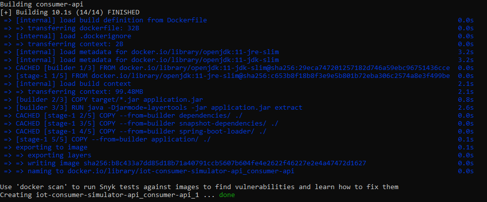
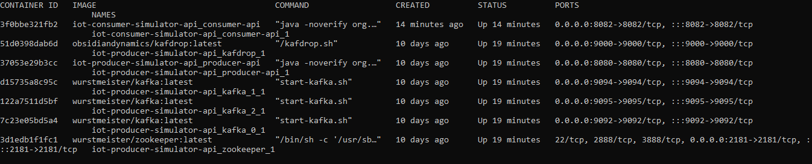

# Consumer Simulator API

Project to simulate IoT sensor consuming events from a Kafka cluster.

## Technologies

- **[Spring boot](https://docs.spring.io/spring-boot/docs/current/reference/htmlsingle/)** - 2.6.1
- **[Maven](https://maven.apache.org/)** - 4.0
- **[H2](https://www.h2database.com/html/main.html)**
- Java 11
- Kafka

## Getting Started

### Requirements

- Docker
    - Needed in case you want to run consumer app using docker.
- Java 11
    - for local run of the project.

### Building

for building using maven you can use

```shell
./mvnw clean install
```

or to start api:

```shell
./mvnw spring-boot:run
```

### Running

1. Install docker: https://docs.docker.com/engine/install/

    - On Linux, docker compose need be installed
      separately: https://docs.docker.com/compose/install/
    - On Windows, you can install Docker Desktop for
      Windows: https://docs.docker.com/desktop/windows/install/

2. Run the docker compose file

   ````bash
   docker-compose -f "docker-compose.yml" up --build -d
   ````

   

   It will start your consumer app:
    - Consumer api 
   
   Other component like producer and kafka components can be started using producer
      repo instructions:
    - 1x [Zookeper](https://hub.docker.com/r/wurstmeister/zookeeper)
    - 3x [Kafka](https://hub.docker.com/r/wurstmeister/kafka) brokers
    - [Kafdrop](https://hub.docker.com/r/obsidiandynamics/kafdrop)
    - Producer API
   
    all containers can be seen as below:
      

4. The IOT consumer starts on `localhost:8082` with docker profile and `localhost:8082` using the default
   profile.

### API endpoints

#### average

````curlrc 
curl --location --request GET 'localhost:8082/events/average?type=TEMPERATURE&clusterId=1&from=2021-12-14T17:28:47.977Z&to=2021-12-14T17:34:47.977Z'
````

:memo: The `type` is a sensor type.

:memo: The `clusterId`, identifies this sensor as belonging to a cluster. Later you can query all
the sensor in the same cluster. This field is optional.

:memo: The `from` is OffsetDatetime timestamp and is mandatory.

:memo: The `to` is OffsetDatetime timestamp is mandatory.

#### max

````curlrc 
curl --location --request GET 'localhost:8082/events/max?type=TEMPERATURE&clusterId=1&from=2021-12-14T17:28:47.977Z&to=2021-12-14T17:34:47.977Z'
````

:memo: The `type` is a sensor type.

:memo: The `clusterId`, identifies this sensor as belonging to a cluster. Later you can query all
the sensor in the same cluster. This field is optional.

:memo: The `from` is OffsetDatetime timestamp and is mandatory.

:memo: The `to` is OffsetDatetime timestamp is mandatory.

#### min

````curlrc 
curl --location --request GET 'localhost:8082/events/min?type=TEMPERATURE&clusterId=1&from=2021-12-14T17:28:47.977Z&to=2021-12-14T17:34:47.977Z'
````

:memo: The `type` is a sensor type.

:memo: The `clusterId`, identifies this sensor as belonging to a cluster. Later you can query all
the sensor in the same cluster. This field is optional.

:memo: The `from` is OffsetDatetime timestamp and is mandatory.

:memo: The `to` is OffsetDatetime timestamp is mandatory.

#### median

````curlrc 
curl --location --request GET 'localhost:8082/events/median?type=TEMPERATURE&clusterId=1&from=2021-12-14T17:28:47.977Z&to=2021-12-14T17:34:47.977Z'
````

:memo: The `type` is a sensor type.

:memo: The `clusterId`, identifies this sensor as belonging to a cluster. Later you can query all
the sensor in the same cluster. This field is optional.

:memo: The `from` is OffsetDatetime timestamp and is mandatory.

:memo: The `to` is OffsetDatetime timestamp is mandatory.

#### Database

Since this is poc we are using in memory database H2. H2 provides very fast easy to use database engine for poc purpose.
We can convert this consumer app to any database engine that we want with minimal changes.

> For the purpose of demonstration we have used spring-data-jpa, but if we need more low level access we can use jdbcTemplate.

> if you have real time events' requirement like dashboard / trading platform, you can take a look at [KsqlDB] (https://ksqldb.io/)


All the sensor events are stored into table called as `EVENT` and it has the following
structure:

| id | sensor_id | cluster_id | name             | type        | creation_time            | value              | initialized |
|----|-----------|------------|------------------|-------------|--------------------------|--------------------|-------------|
| 1  | 1         | 1          | Living Room Temp | TEMPERATURE | 2021-12-14T17:28:47.977Z | 29.455555555555900 | true        |
| 2  | 1         | 1          | Living Room Temp | TEMPERATURE | 2021-12-14T17:29:47.977Z | 34.578834934039    | true        |
| 3  | 2         | 2          | Humidity in Air  | HUMIDITY    | 2021-12-14T17:30:47.977Z | 95.77885566789888  | true        |
